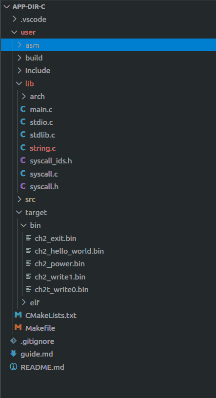
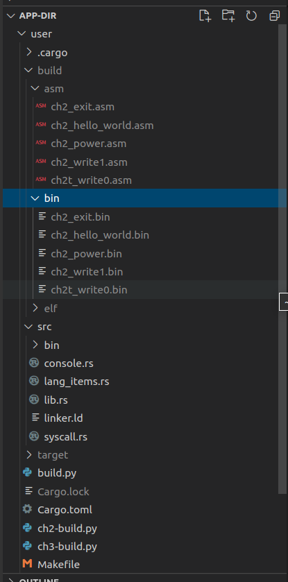
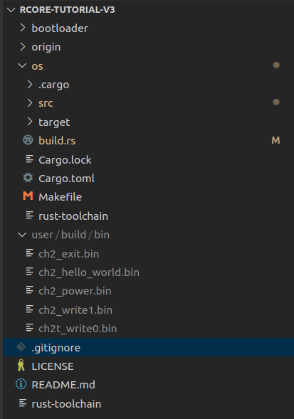
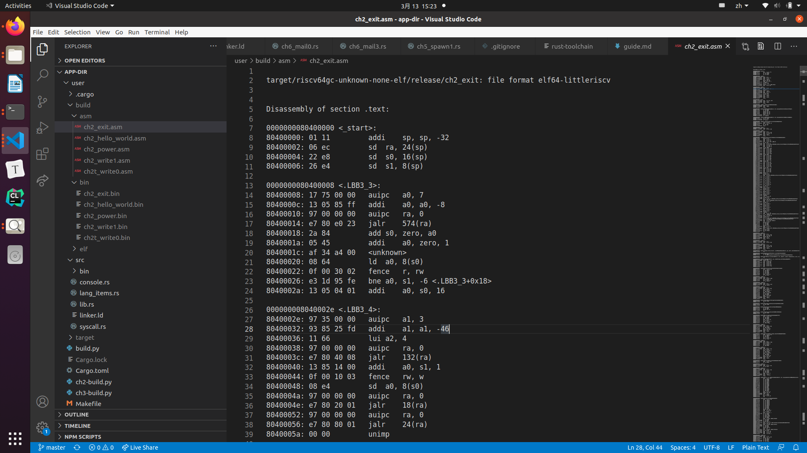
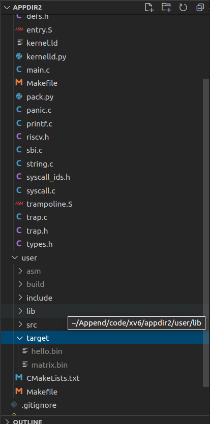
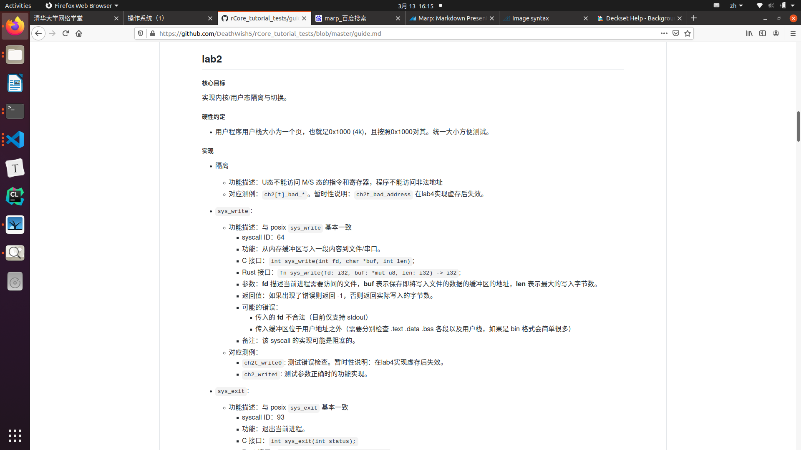

-----
marp: true
-----

# 3.13 报告

## 项目架构与测例的打开方式

##  
---



### 测例仓库

* make all CHAPTER=X
    * 使用了自定义的 user_lib
    * cargo/cmake 得到 elf 程序
    * objdump 得到 asm 和 bin

---

### 用户程序的加载 (Rust)



```rust
// build.rs

static TARGET_PATH: &str = "../user/build/bin/";

fn insert_app_data() -> Result<()> {
    let mut f = File::create("src/link_app.S").unwrap();
    let mut apps: Vec<_> = read_dir(TARGET_PATH);
    // ...
    for (idx, app) in apps.iter().enumerate() {
        println!("app_{}: {}", idx, app);
        writeln!(
            f,
            r#"
    .section .data
    .global app_{0}_start
    .global app_{0}_end
app_{0}_start:
    .incbin "{2}{1}"
app_{0}_end:"#,
            idx, app, TARGET_PATH
        )?;
    })
}
```

```rust
// os/main.rs
global_asm!(include_str!("link_app.S"));
```
---



### 用户程序的加载 (Rust)

```rust
    static ref APP_MANAGER: AppManager = AppManager {
        inner: RefCell::new({
            extern "C" {
                fn _num_app();
            }
            let num_app_ptr = _num_app as usize as *const usize;
            let num_app = unsafe { num_app_ptr.read_volatile() };
            let mut app_start: [usize; MAX_APP_NUM + 1] = [0; MAX_APP_NUM + 1];
            let app_start_raw: &[usize] =
                unsafe { core::slice::from_raw_parts(num_app_ptr.add(1), num_app + 1) };
            app_start[..=num_app].copy_from_slice(app_start_raw);
            // ...
        }),
    };
```

```rust
    unsafe fn load_app(&self, app_id: usize) {
        // ...
        let app_src = core::slice::from_raw_parts(
            self.app_start[app_id] as *const u8,
            self.app_start[app_id + 1] - self.app_start[app_id],
        );
        let app_dst = core::slice::from_raw_parts_mut(APP_BASE_ADDRESS as *mut u8, app_src.len());
        app_dst.copy_from_slice(app_src);
    }
```

---



### 用户程序的加载 (C)

```python
// pack.py
TARGET_DIR = "../user/target/bin"

if __name__ == '__main__':
    f = open("link_app.S", mode="w")
    apps = os.listdir(TARGET_DIR)
    # ...
    for (idx, app) in enumerate(apps):
        f.write(
'''
    .section .data.app{0}
    .global app_{0}_start
app_{0}_start:
    .incbin "{1}"
'''.format(idx, TARGET_DIR + app)
        )
    f.write('app_{}_end:\n\n'.format(len(apps) - 1))
    f.close()
```

```Makefile
SRCS = $(wildcard *.S *.c)
OBJS = $(addsuffix .o, $(basename $(SRCS))) link_app.o
```

## kernel.ld ?

```diff
    .data : {
        *(.data)
+       . = ALIGN(0x1000);
+       *(.data.app0)
+       . = ALIGN(0x1000);
+       *(.data.app1)
        *(.data.*)
    }
```

---

### 用户程序的加载 (C)

```c
// kernel/batch.c

void batchinit() {
    if((uint64)ekernel >= BASE_ADDRESS) {
        panic("kernel too large...\n");
    }
    app_info_ptr = (uint64*) _app_num;
    app_cur = -1;
    app_num = *app_info_ptr;
}

void load_app(uint64* info) {
    uint64 start = info[0], end = info[1], length = end - start;
    memmove((void*)BASE_ADDRESS, (void*)start, length);
}
```

---



## 测例的打开方式

* `make all` 得到 bin
* cp / ln -> TARGET_DIR
* make run

不推荐：
* 直接 copy .c / .rs 文件，接口存在不一致
* 测例 guide.md

---

## 正确输出

```
# sysexit(1234)         // ch2_exit
Hello world from user mode program!
Test hello_world OK!    // ch2_hello_world
# sysexit(0)
3^10000=5079
...
3^100000=2749
Test power OK!          // ch2_power
# sysexit(0)
string from data section
strinstring from stack section
strin
Test write1 OK!         // ch2_write1
# error write in 0x0 ...
Test write0 OK!         // ch2t_write0
# sysexit(0)
```

---

## 实现 tips

实现要求：

> 由于还没有实现虚拟内存，我们可以在用户程序中指定一个属于其他程序字符串，并将它输出，这显然是不合理的，因此我们要对 sys_write 做检查：
> - 传入的 **fd** 是否合法（目前仅支持 stdout，也就是 1）
> - 传入缓冲区是否位于用户地址之外（需要检查 .text .data .bss 各段以及用户栈，如果是 bin 格式会简单很多）

---

## 实现 tips

用户地址？
* [app_i_start, app+i_end) ?
* user_stack ?

print 大法好！
```c
uint64 sys_write(int fd, char *str, uint len) {
    printf("fd = %d, buf = %p, len = %d\n",fd, str, len);
    // ...
}
```
```
// ch2_hello_world
fd = 1, buf = 0x0000000080400dd0, len = 56
fd = 1, buf = 0x0000000080219fcf, len = 1
```

---

// TODO 此处该有图

## 实现 tips

框架代码随便动！欢迎大动特动！

不推荐修改的文件：

* Makefile: make run
    ```
    run:
        @echo TEST hello_wrold passed!
    ```

---
## lab3 坑点：gettime

``` rust
// 框架
pub fn sys_get_time() -> isize;
```
```rust
// 测例
pub fn get_time() -> isize {
    let time = TimeVal::new();
    match sys_get_time(&time, 0) {
        0 => ((time.sec & 0xffff) * 1000 + time.usec / 1000) as isize,
        _ => -1,
    }
}

pub fn sys_get_time(time: &TimeVal, tz: usize) -> isize;
```
```c
// guide.md
struct TimeVal {
    int sec,	// 自 Unix 纪元起的秒数
    int usec,	// 微秒，也就是除了秒的那点零头
}
```
---

## lab3 坑点：频率不统一

时间？ ==> time 寄存器

```rust
// config.rs
#[cfg(feature = "board_qemu")]
pub const CLOCK_FREQ: usize = 12500000;
```
```c
// 10ms 一个时钟中断 ==> 频率:25000000Hz
void set_next_timer() {
    uint64 timebase = 250000; // 250000 => 125000
    set_timer(get_cycle() + timebase);
}
```
以 Rust 为准，也可以不改，基本不影响实验。

---

## lab3 坑点：通过测例 != 实现正确

一个苦难先行者的故事：
手滑，返回值写错了，使得 gettime 始终返回 1。

```c
/// 正确输出：（无报错信息）
/// get_time OK! {...}
/// TEST sleep OK!

int main() {
    int64 current_time = get_time();
    assert(current_time > 0);
    printf("get_time OK! %lu\n", current_time);
    int64 wait_for = current_time + 3000;
    while (get_time() < wait_for) {
        sched_yield();
    }
    puts("Test sleep OK!\n");
    return 0;
}
```
---
## lab3 坑点： 无法无天的 swtch

os 难点：执行流

```rust
fn run_first_task(&self) {
    // ...
    unsafe { 
        //在进入之前好像还什么问题也没有。
        //怎么回事，似乎是进入__switch函数了但是又没有在断点处停下。
        __switch(
            &_unused as *const _,
            next_task_cx_ptr2,
        );
    }
}
```
```c

```
---
## lab3 捷径： 优先级队列

// TODO： 此处该有图

```c
for(;;){
    sel = 0;
    for(p = pool; p < &pool[NPROC]; p++) {
        if(p->state == RUNNABLE) {
            if((int)(sel->stride - p->stride)>0) 
                sel = p;
        }
    }
}
```
```rust
use alloc::collections::binary_heap::BinaryHeap;
fn find_next_task(&self) -> Option<Stride> {
    self.inner.borrow_mut().heap.pop()
}
```
---
## debug 小例子1

// str_len

```asm
    80400864:	00000617          	auipc	a2,0x0
    80400868:	67c63603          	ld	a2,1660(a2) # 80400ee0 <main+0x124>
    8040086c:	a019                	j	80400872 <strlen+0x38>
    8040086e:	6794                	ld	a3,8(a5)
    80400870:	07a1                	addi	a5,a5,8
    80400872:	00b68733          	add	a4,a3,a1
    80400876:	fff6c693          	not	a3,a3
```

```hex
00000db0: C0 F9 01 46 73 00 00 00 01 25 82 80 41 11 17 05    @y.Fs....%..A...
00000dc0: 00 00 13 05 A5 01 06 E4 EF F0 EF A8 A2 60 01 45    ....%..dopo("`.E
00000dd0: 41 01 82 80 00 00 00 00 48 65 6C 6C 6F 20 77 6F    A.......Hello.wo
00000de0: 72 6C 64 20 66 72 6F 6D 20 75 73 65 72 20 6D 6F    rld.from.user.mo
00000df0: 64 65 20 70 72 6F 67 72 61 6D 21 0A 54 65 73 74    de.program!.Test
00000e00: 20 68 65 6C 6C 6F 5F 77 6F 72 6C 64 20 4F 4B 21    .hello_world.OK!
00000e10: 00 00 00 00 00 00 00 00 28 6E 75 6C 6C 29 00 00    ........(null)..
00000e20: FF FE FE FE FE FE FE FE 80 80 80 80 80 80 80 80    .~~~~~~~........
00000e30: 01 01 01 01 01 01 01 01 30 31 32 33 34 35 36 37    ........01234567
00000e40: 38 39 61 62 63 64 65 66 00                         89abcdef.
```

---

## Rust 编程 pattern

```rust
pub struct TaskManager {
    num_app: usize,
    inner: RefCell<TaskManagerInner>,
}

struct TaskManagerInner {
    tasks: [TaskControlBlock; MAX_APP_NUM],
    current_task: usize,
}

unsafe impl Sync for TaskManager {}

lazy_static! {
    pub static ref TASK_MANAGER: TaskManager = {
        // ...    
    };
}
```
---

## Rust 编程 pattern

```rust
pub fn borrow_mut(&self) -> RefMut<'_, T>
```

Mutably borrows the wrapped value.

The borrow lasts until the returned RefMut or all RefMuts derived from it exit scope. The value cannot be borrowed while this borrow is active.

---
## Rust 编程 pattern


```rust
fn mark_current_suspended() {
    TASK_MANAGER.mark_current_suspended();
}

fn mark_current_suspended(&self) {
    let mut inner = self.inner.borrow_mut();
    let current = inner.current_task;
    inner.tasks[current].task_status = TaskStatus::Ready;
}
```